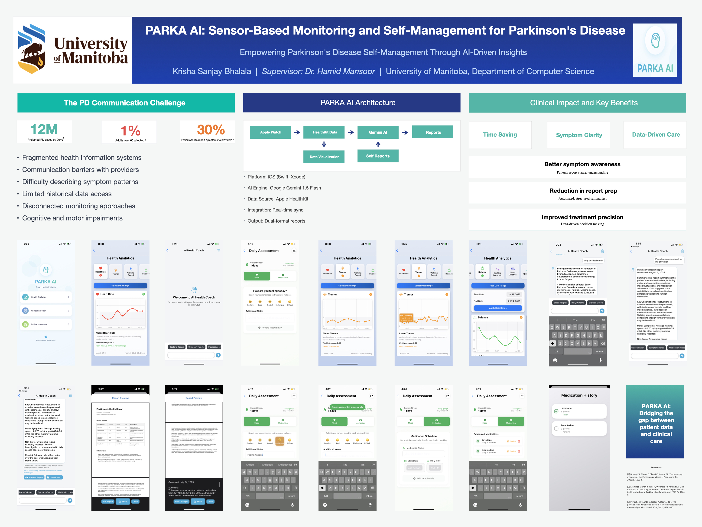

# Parka AI

[](https://developer.apple.com/swift/) 
[](https://developer.apple.com/ios/) 
[](LICENSE)

Parka AI is an iOS app for monitoring and self-managing Parkinson’s disease. It integrates Apple HealthKit data with AI-powered insights to provide clear summaries for users and structured reports for healthcare providers.

---

## Features

- **HealthKit Integration**: Track tremor intensity, heart rate, steps, walking speed, and sleep.  
- **Daily Self-Reports**: Log mood and medication adherence.  
- **AI Insights**: Generates user-friendly summaries and clinician reports.  
- **Accessible UI**: Large fonts, high-contrast visuals, and zoomable charts for ease of use.  
- **Clinician Reporting**: Quickly visualize trends and track treatment outcomes.

---

## Usage
- Launch the app on an iPhone paired with Apple Watch.
- Navigate the dashboard to view HealthKit data and self-reports.
- Use the AI Coach to generate summaries and clinician reports.
- Log daily moods and medications to track trends over time.

## Installation

1. Clone the repository:  
```bash
git clone https://github.com/YOUR_USERNAME/ParkaAI.git
```
2.Open in Xcode:
```bash

## Research Poster

Here’s an overview of Parka AI, including screenshots, workflow, and key features:



[Download the full poster (JPEG)](ParkaAI_Poster.jpeg)

cd ParkaAI
open Parka\ AI.xcodeproj
```
Add your API keys in APIConfig.plist (this file is ignored by Git).
Build and run on a simulator or device.
